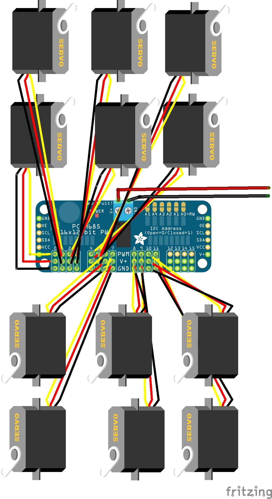

Para el control de los motores hemos necesitado un componente adicional para el control PWM. El esquema de la PCA, encargada de los motores es la siguiente:

Y el esquema usado en la Arduino Mega el siguiente:

