# REPARACIÓN DE COMPONENTES

En este apartado introduciré como repara algunos componentes.

## COMPONENTES BASE

 si el componente se encuentra en la base inferior, bastará con desatornillar la placa superior. En caso de que sea de la parte superior, bastará con retirarlo y remplazarlo.

## CAMBIO DEL MOTOR 2 DE LA PATA

En primer lugar desatornillamos la parte superior.

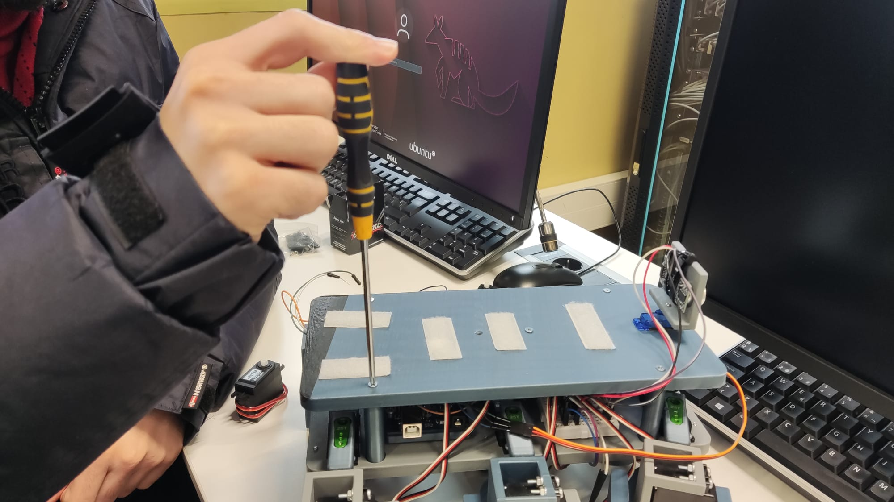

A continucación extraemos la pata afectada.

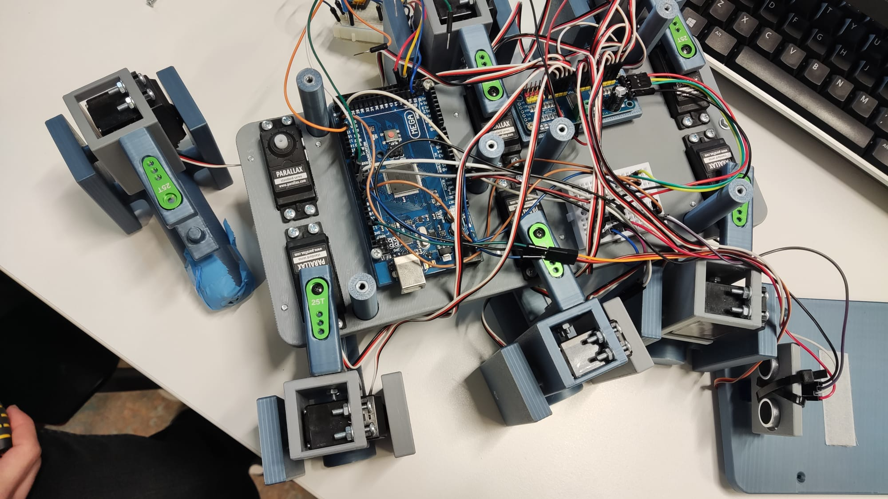

Desatornillamos el extremo de la pata.

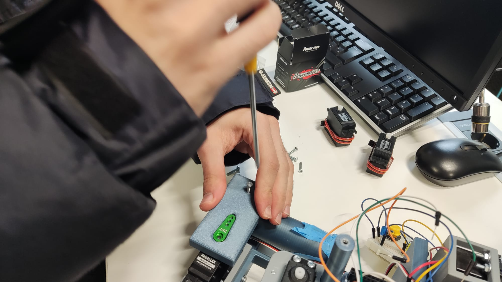

Desatornillamos el motor.

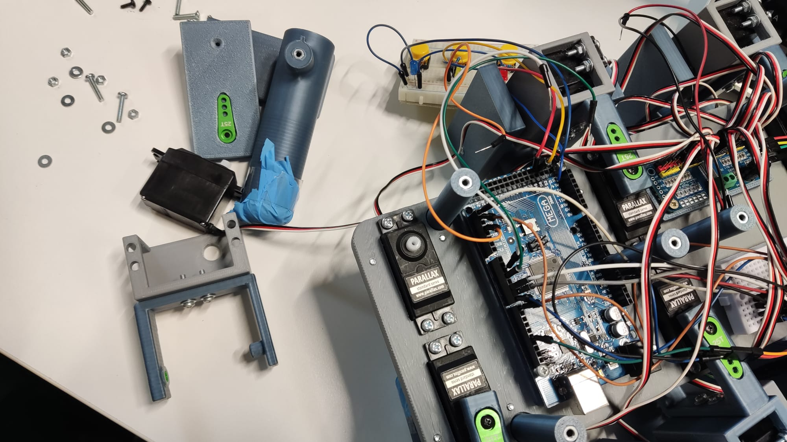

Sustituyes el motor afectado y vuelves a atornillarlo.

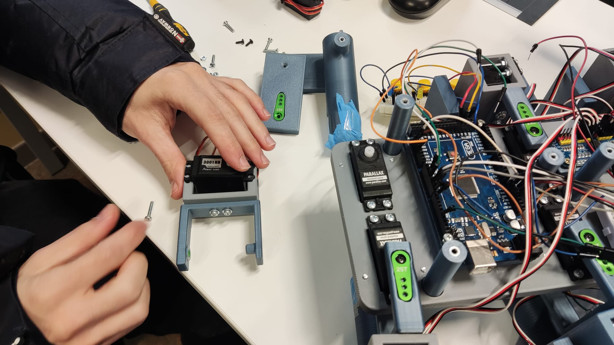

Vuelves a atornillar el extremo de la pata.

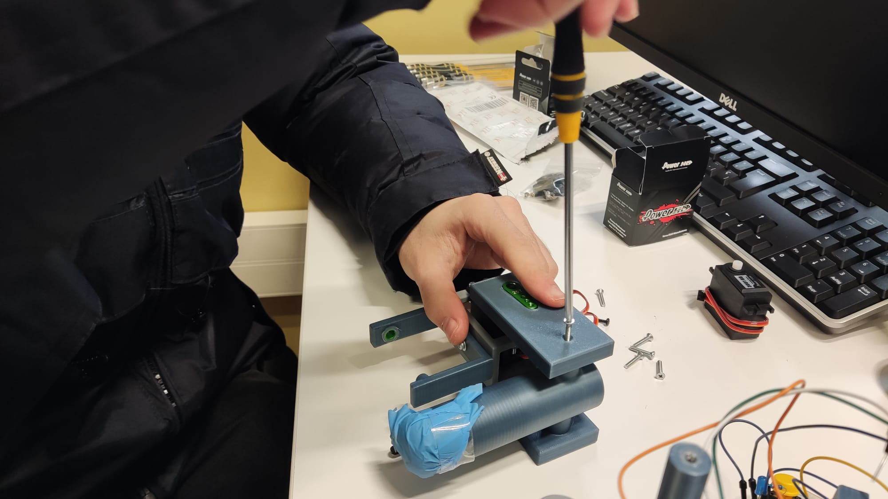

Vuelves a colocar la pata en posición.

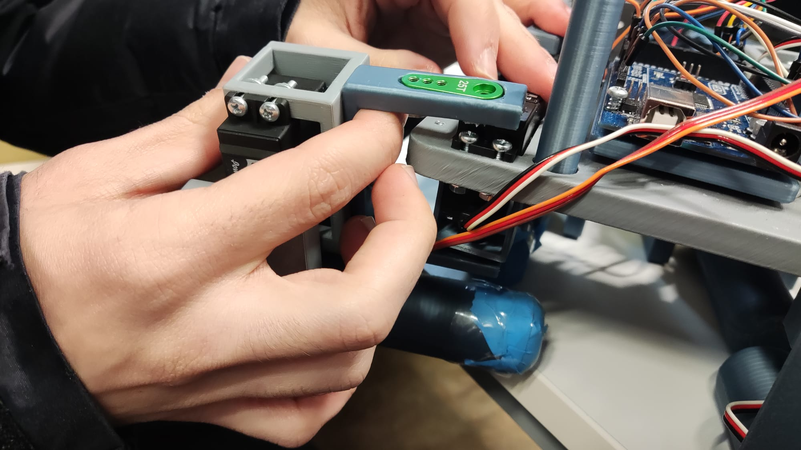

Por último atornillar la tapa superior.

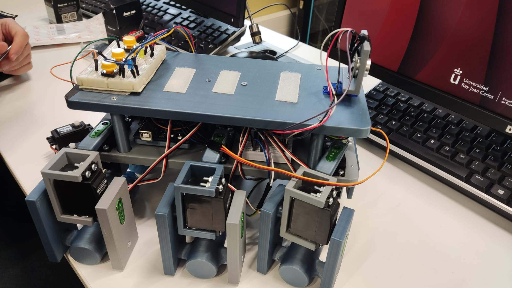

## CAMBIO DEL MOTOR 1 DE LA PATA

En primer lugar desatornillamos la parte superior.

A continucación extraemos la pata afectada.

En primer lugar destornillar la base del motor.

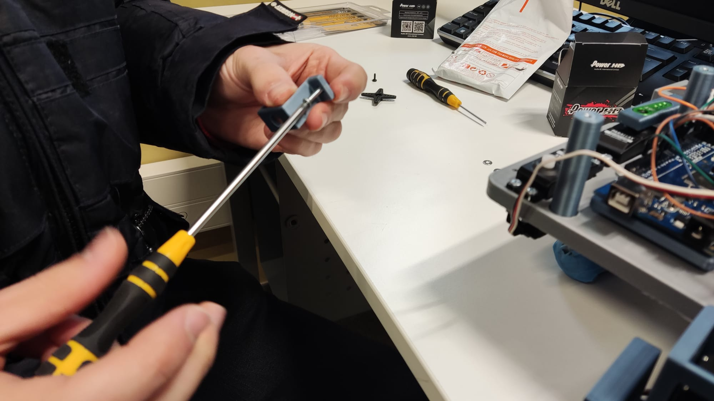

A continuación desatornillar el motor de la base.

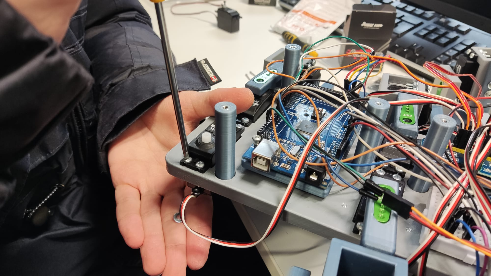

Tercer paso, desatornillar la parte inferior del motor.

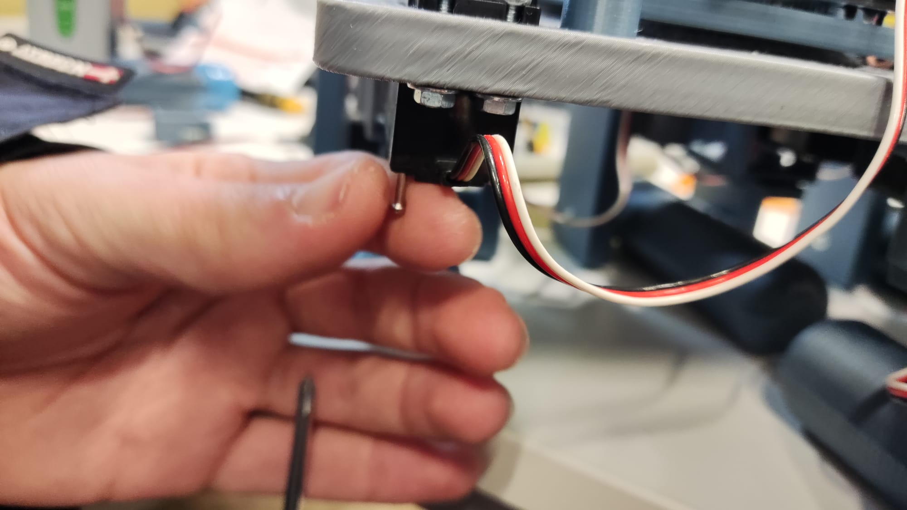

Por último retirar el motor, y repetir estos pasos a la inversa para montarlo.